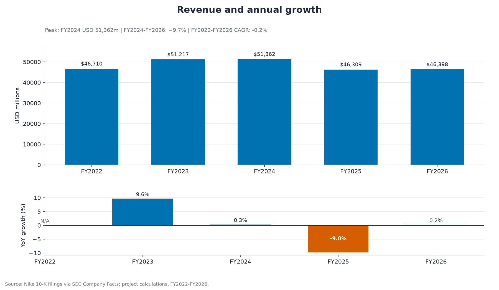
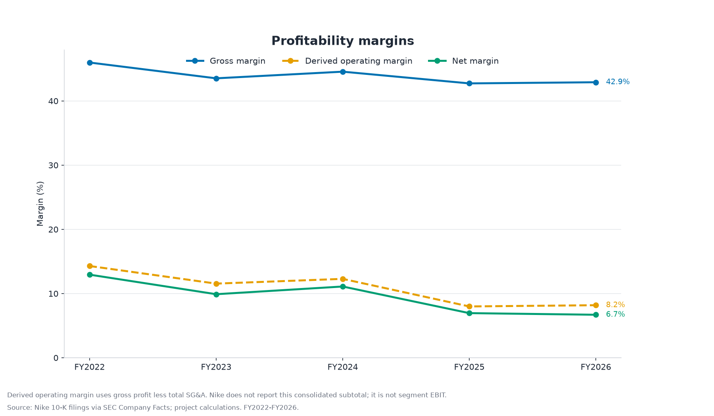
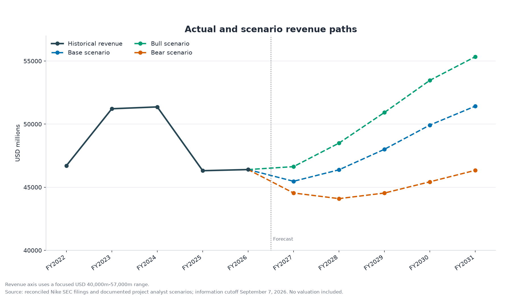
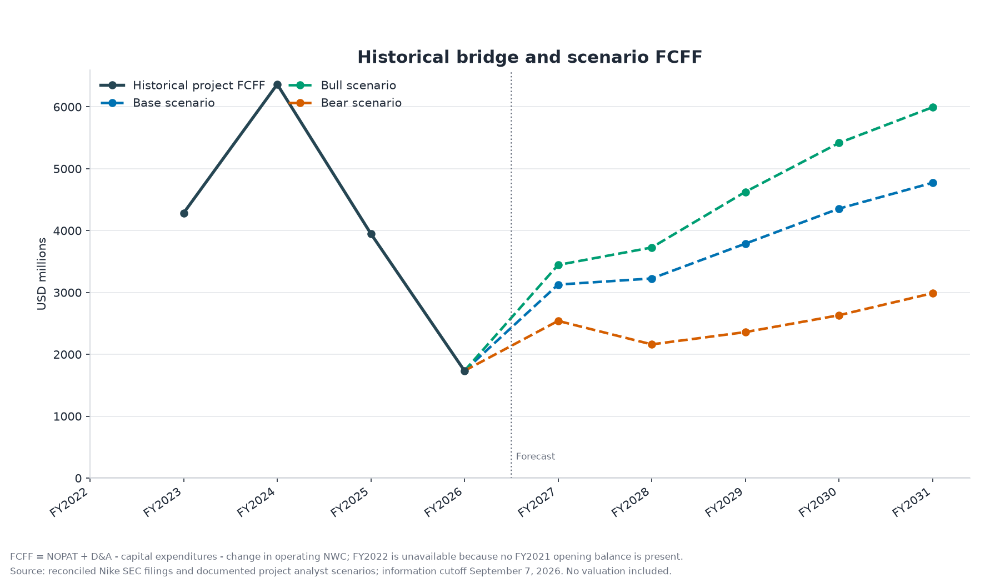

# Nike Financial Analysis

Reproducible Python analysis of Nike's FY2022-FY2026 financial performance and
FY2027-FY2031 operating scenarios using reconciled SEC data and auditable
calculation lineage.

> **Project status:** The SEC data foundation, reconciled FY2022-FY2026 historical
> dataset, recruiter-facing historical analysis, and documented FY2027-FY2031
> operating scenarios are implemented. Valuation and the Excel model have not begun.

This independent portfolio analysis combines historical results with documented
project analyst scenarios. It is not an investment recommendation.

## Project objective

The completed project will answer six business questions:

1. How have Nike's revenue, profitability, and cash generation changed?
2. Which reported operating and cost trends accompany changes in margins?
3. What do inventory, receivables, working capital, and cash conversion suggest?
4. How effectively has accounting income translated into cash flow?
5. What assumptions support coherent base, bull, and bear operating scenarios?
6. What valuation range follows from those assumptions, and which assumptions matter
   most?

The historical analysis addresses the first four questions. Phase 4 adds project
analyst operating scenarios for question five without valuation or an investment
recommendation.

## Historical scope and data foundation

The analysis covers Nike fiscal years FY2022-FY2026, each ending May 31. The Python
pipeline:

- verifies Nike's ticker and CIK through official SEC data;
- selects five unique annual 10-K periods;
- retrieves and caches SEC Company Facts and filing evidence;
- applies deterministic form, period, unit, taxonomy, duplicate, and amendment rules;
- reconciles selected observations to consolidated face statements;
- preserves competing facts and calculation lineage in a source manifest; and
- blocks uncertain or missing inputs from analytical calculations.

The committed [historical dataset](data/processed/nike_financials.csv) is accompanied
by a detailed [source manifest](data/metadata/source_manifest.csv) and
[validation summary](data/metadata/validation_summary.csv).

## Historical findings

- Revenue reached $51,362 million in FY2024 before declining $4,964 million, or
  9.7%, to $46,398 million in FY2026. That left FY2026 revenue $312 million, or 0.7%,
  below FY2022, corresponding to a -0.2% four-interval CAGR.
- Gross margin decreased from 46.0% to 42.9%, down 3.1 percentage points. Derived
  operating margin decreased from 14.3% to 8.2%, down 6.1 points, and net margin
  decreased from 12.9% to 6.7%, down 6.2 points. Over the same period, SG&A increased
  from 31.7% to 34.7% of revenue, up 3.0 points.
- Free cash flow declined $4,433 million, or 67.0%, from its $6,617 million FY2024
  peak to $2,184 million in FY2026. FY2026 FCF margin was 4.7%, and operating cash
  flow equaled 0.92x net income.
- Cash plus short-term investments decreased from $12,997 million to $9,027 million,
  the current ratio moved from 2.63x to 1.96x, and net working capital decreased from
  $17,483 million to $12,056 million. FY2026 receivables grew 25.7% while revenue grew
  0.2%; the receivables-days proxy increased from 36.0 to 41.9 days.
- Interest-bearing debt decreased from $9,430 million to $7,942 million, while the
  net-cash buffer narrowed from $3,567 million to $1,085 million. FY2026 operating
  lease liabilities of $3,091 million remain separate from debt.





The complete narrative, all five figures, and supporting tables appear in the
[historical-analysis notebook](notebooks/01_historical_analysis.ipynb). A shorter
review copy is maintained in [historical findings](docs/historical_findings.md).

## FY2027-FY2031 operating scenarios

Phase 4 translates the reconciled history into base, bull, and bear consolidated
operating forecasts. These are documented project analyst scenarios, not Nike
guidance, consensus estimates, probabilities, or price targets. The information
cutoff is September 7, 2026; Nike's subsequently scheduled FY2027 first-quarter
results are excluded.

- Base revenue declines 2.0% in FY2027, then recovers to USD 51,421 million in
  FY2031. Derived operating margin moves from 7.3% to 12.0%, and FCFF reaches
  USD 4,773 million.
- Bull revenue reaches USD 55,337 million in FY2031, with a 14.0% derived operating
  margin and USD 5,994 million of FCFF. Higher growth is paired with higher capex.
- Bear revenue declines through FY2028 and finishes at USD 46,337 million in FY2031.
  Derived operating margin reaches 8.2%, and FCFF reaches USD 2,988 million.

FY2026 reported gross margin remains 42.9%. Nike disclosed that the year included
an approximately 210-basis-point IEEPA tariff-recovery benefit and would have been
approximately 40.8% excluding that benefit. The forecast does not replace the
reported actual; FY2027 scenario margins imply different degrees of underlying
operational recovery.





See the [scenario-forecast notebook](notebooks/02_scenario_forecast.ipynb),
[forecast methodology](docs/forecast_methodology.md),
[scenario rationale](docs/scenario_rationale.md),
[documented assumption register](config/scenario_assumptions.csv), and
[forecast source register](config/forecast_sources.csv).

## Accounting and analytical conventions

- Derived operating income equals gross profit less total selling and administrative
  expense. Nike does not report this consolidated subtotal, and it is not segment
  EBIT.
- Depreciation and amortization uses `Depreciation` for FY2022 and
  `DepreciationDepletionAndAmortization` for FY2023-FY2026. The tag transition remains
  visible in the source manifest.
- Interest-bearing debt equals notes payable or short-term borrowings plus current
  and noncurrent long-term debt. FY2026 short-term borrowings are a filing-supported
  documented zero.
- Operating lease liabilities remain separate from interest-bearing debt.
- Capital expenditures are positive investment amounts. Phase 3 historical free
  cash flow equals operating cash flow less capital expenditures. Phase 4 FCFF
  equals NOPAT plus D&A less capital expenditures and the change in operating NWC.
  These related measures are not interchangeable.
- Cash conversion is a ratio in `x`, not a percentage.
- Inventory days and `receivables_days_proxy` use average balances and a consistent
  365-day analytical convention. FY2022 is not applicable because FY2021 opening
  balances are not in the committed dataset. The receivables measure uses total
  revenue rather than disclosed credit sales and is therefore not called DSO.
- Signed net debt equals interest-bearing debt less cash and short-term investments.
  A negative value means net cash; operating leases are excluded.

## Windows PowerShell setup

The environment is tested with uv-managed CPython 3.14.5. From a fresh clone:

```powershell
uv sync --locked --python 3.14.5
.\.venv\Scripts\Activate.ps1
```

`pyproject.toml` defines dependencies and `uv.lock` pins the resolved environment.
There is intentionally no separately maintained `requirements.txt`.

## Reproduce the historical data

SEC retrieval requires a descriptive local user agent. Copy `.env.example` to
`.env`, replace the placeholder locally, and never commit `.env`:

```powershell
Copy-Item .env.example .env
uv run nike-sec-filings --ticker NKE --count 5
uv run nike-historical-data
```

The SEC client never prints the configured value. It uses conservative throttling,
timeouts, retries, and an ignored cache under `data/raw/sec/`.

## Reproduce the historical analysis

Phase 3 requires no network access or `.env`. It reads only the committed Phase 2
files:

```powershell
uv run nike-historical-analysis
uv run nike-execute-notebook notebooks/01_historical_analysis.ipynb --in-place
uv run pytest
```

The artifact command rebuilds:

- [historical summary](outputs/tables/historical_summary.csv)
- [audit-friendly KPI table](outputs/tables/historical_kpis.csv)
- [five static charts](outputs/charts/)

## Reproduce the operating scenarios

Phase 4 also requires no network access or `.env`. It protects the committed Phase
2-3 artifacts before calculating the forecast:

```powershell
uv run nike-scenario-forecast
uv run nike-execute-notebook notebooks/02_scenario_forecast.ipynb --in-place
uv run pytest
```

The command rebuilds the long-form forecast, readable scenario summary, resolved
assumption audit, validation summary, and four static forecast charts. It does not
perform valuation.

## Repository guide

- `src/nike_financial_analysis/` — SEC access, selection, calculations, charts, and
  notebook execution
- `data/processed/` — committed reconciled historical data
- `data/metadata/` — filing index, provenance, and validation results
- `outputs/` — generated historical tables and figures
- `notebooks/` — rendered analytical narrative
- `docs/` — methodology, data dictionary, decisions, findings, and limitations
- `tests/` — deterministic fixtures and pipeline, calculation, chart, artifact, and
  notebook tests

See the [methodology](docs/methodology.md), [data dictionary](docs/data_dictionary.md),
[decision log](docs/decision_log.md), and [limitations](docs/limitations.md) for the
full audit trail.

## Limitations and future work

Five annual observations cannot show quarterly seasonality or establish causation.
Several project conventions, including derived operating income, the aggregate
operating-NWC proxy, the D&A tag transition, the receivables-days proxy, and
operating-lease exclusion, require care when interpreting the figures. A future
phase may use the operating forecast in a formula-driven DCF. Peer valuation,
machine learning, stock-price prediction, and interactive dashboards remain outside
version one.
