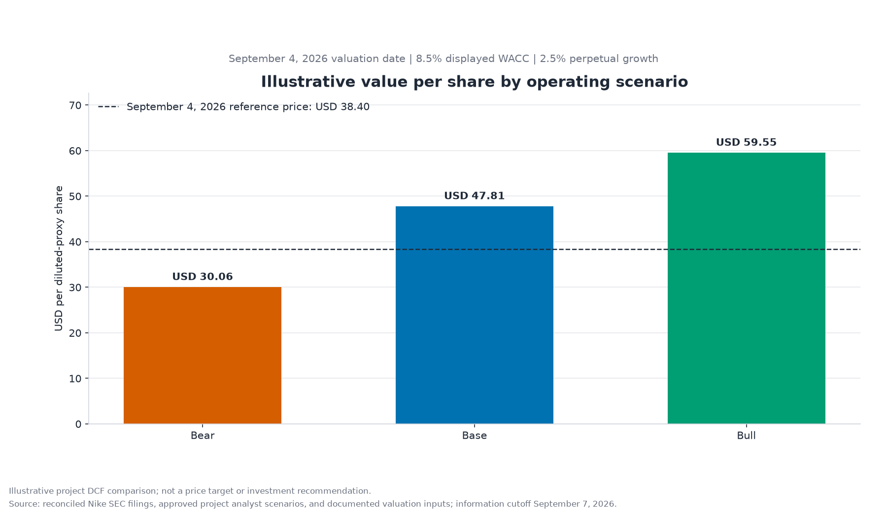

# Nike Financial Analysis and DCF Valuation

Independent portfolio project covering Nike's FY2022-FY2026 reported performance,
FY2027-FY2031 operating scenarios, and an illustrative discounted-cash-flow
valuation. Historical accounting data is reconciled to official SEC filings and
carried through auditable Python calculations and a formula-driven Excel model.

| Scope item | Date or period |
|---|---|
| Historical analysis | FY2022-FY2026 |
| Operating scenarios | FY2027-FY2031 |
| DCF model date | May 31, 2026 |
| Information cutoff | September 7, 2026 |
| Reference market price | $38.40 on September 4, 2026 |

**Bottom line:** Revenue reached $51.4 billion in FY2024 before falling 9.7% to
$46.4 billion in FY2026. Derived operating margin declined from 14.3% in FY2022 to
8.2% in FY2026, and FY2026 free cash flow was 67.0% below its FY2024 peak. The
project's three approved operating scenarios produce illustrative values of $29.44
to $58.30 per diluted-proxy share; the range is highly dependent on terminal value.

**Start here:** [Download the Excel valuation model](model/nike_valuation_model.xlsx)
· [Read the project walkthrough](docs/project_walkthrough.md)
· [Open the historical notebook](notebooks/01_historical_analysis.ipynb)
· [Open the scenario notebook](notebooks/02_scenario_forecast.ipynb)
· [Inspect the valuation outputs](outputs/model_exports/valuation_summary.csv)

This is historical and scenario-based analysis, not an investment recommendation
or price target.

## Project overview

The project answers six connected questions:

1. How did Nike's revenue, profitability, and cash generation change?
2. Which reported operating and cost trends accompanied margin changes?
3. What do inventory, receivables, liquidity, and cash conversion indicate?
4. How effectively did accounting income translate into cash flow?
5. What assumptions support coherent Base, Bull, and Bear operating scenarios?
6. What illustrative valuation range follows from those assumptions, and which
   inputs matter most?

The completed workflow combines SEC filing discovery, deterministic XBRL selection,
face-statement reconciliation, historical analysis, a five-year consolidated
forecast, a Python DCF, and a reviewer-facing Excel translation.

## Key findings

- **Revenue:** FY2024 revenue peaked at $51,362 million, then declined $4,964
  million to $46,398 million in FY2026. FY2026 finished 0.7% below FY2022, a -0.2%
  four-interval CAGR.
- **Profitability:** Gross margin fell from 46.0% in FY2022 to 42.9% in FY2026.
  Derived operating margin fell from 14.3% to 8.2%, while SG&A rose from 31.7% to
  34.7% of revenue. Derived operating income is gross profit less total SG&A; it is
  not a Nike-reported subtotal or segment EBIT.
- **Cash generation:** Free cash flow fell 67.0% from $6,617 million in FY2024 to
  $2,184 million in FY2026. FY2026 FCF margin was 4.7%, and operating cash flow was
  0.92x net income.
- **Liquidity and working capital:** Cash plus short-term investments declined from
  $12,997 million to $9,027 million between FY2022 and FY2026. The current ratio
  moved from 2.63x to 1.96x, and the receivables-days proxy increased from 36.0 days
  in FY2025 to 41.9 days in FY2026.
- **Capital structure:** Interest-bearing debt declined from $9,430 million to
  $7,942 million, but the net-cash buffer narrowed from $3,567 million to $1,085
  million. FY2026 operating lease liabilities of $3,091 million are shown
  separately from debt.


Revenue finished close to its FY2022 level only after reaching a substantially
higher FY2024 peak. The [historical findings](docs/historical_findings.md) and
[historical notebook](notebooks/01_historical_analysis.ipynb) provide the complete
five-chart analysis and calculation detail.

## Illustrative valuation summary

All three cases use the approved FY2027-FY2031 operating scenarios, a
formula-derived 8.4874% WACC, a common 2.5% perpetual-growth rate, and exact
fiscal-year-end discounting.

| Scenario | Illustrative value/share | Comparison with $38.40 reference | Terminal value / EV |
|---|---:|---:|---:|
| Bear | $29.44 | 23.3% below | 76.7% |
| Base | $46.81 | 21.9% above | 78.2% |
| Bull | $58.30 | 51.8% above | 79.1% |



These values are conditional scenario outputs, not probability-weighted outcomes,
stock-price forecasts, or recommendations. Terminal value represents more than 75%
of enterprise value in every scenario and is therefore a material analytical
warning. See the [valuation methodology](docs/valuation_methodology.md) and
[valuation validation output](outputs/model_exports/valuation_validation_summary.csv).

## What the project demonstrates

- Financial-statement analysis and accounting-definition discipline
- SEC filing and XBRL data engineering with deterministic fact selection
- Documented source lineage across 339 manifest observations
- Decimal-based historical, forecast, and valuation calculations
- Three coherent operating scenarios with 105 approved driver assumptions
- FCFF, bottom-up WACC, terminal-value, and enterprise-to-equity bridge mechanics
- A native-formula Excel model reconciled to an authoritative Python implementation
- Automated validation, deterministic artifact generation, and 105 project tests
- Clear communication of assumptions, limitations, and non-recommendation scope

## Analytical workflow

```text
SEC filings and XBRL facts
        |
        v
Reconciled FY2022-FY2026 dataset + source manifest
        |
        v
Historical KPIs, notebook, and static charts
        |
        v
Approved FY2027-FY2031 Base / Bull / Bear scenarios
        |
        v
Authoritative Python DCF + sensitivity outputs
        |
        v
Formula-driven Excel model + independent workbook checks
```

Reported facts, filing-supported documented zeros, project-derived metrics, analyst
assumptions, and calculated valuation outputs remain separately labelled throughout
the workflow.

## Repository guide

| Location | Purpose |
|---|---|
| [`data/processed/`](data/processed/) | Reconciled historical dataset |
| [`data/metadata/`](data/metadata/) | Source manifest and validation results |
| [`config/`](config/) | XBRL mappings, scenario assumptions, and valuation inputs |
| [`src/nike_financial_analysis/`](src/nike_financial_analysis/) | Reusable extraction, analysis, forecast, valuation, and workbook logic |
| [`notebooks/`](notebooks/) | Rendered historical and scenario narratives |
| [`outputs/`](outputs/) | Reviewer-ready tables, charts, and valuation exports |
| [`model/nike_valuation_model.xlsx`](model/nike_valuation_model.xlsx) | Verified formula-driven Excel model |
| [`docs/`](docs/) | Walkthrough, methodology, decisions, definitions, and limitations |
| [`tests/`](tests/) | Deterministic calculation, artifact, notebook, and workbook tests |

For an end-to-end explanation, read the
[project walkthrough](docs/project_walkthrough.md). Detailed references include the
[methodology](docs/methodology.md), [data dictionary](docs/data_dictionary.md),
[decision log](docs/decision_log.md), and [limitations](docs/limitations.md).

## How to reproduce the project

### Requirements

- Git
- [uv](https://docs.astral.sh/uv/getting-started/installation/)
- uv-managed CPython 3.14.5
- Windows desktop Microsoft Excel only when regenerating the verified `.xlsx` model

From Windows PowerShell:

```powershell
git clone https://github.com/owencchapman24/nike-financial-analysis.git
Set-Location nike-financial-analysis
uv sync --locked --python 3.14.5
uv run pytest
```

The locked Python environment and all commands except Excel recalculation are
cross-platform. The committed datasets, notebooks, charts, CSV outputs, and
recalculated workbook are ready to inspect without rebuilding.

### Deterministic offline rebuild

The following commands use committed inputs and require neither network access nor
`.env`:

```powershell
uv run nike-historical-analysis
uv run nike-execute-notebook notebooks/01_historical_analysis.ipynb --in-place
uv run nike-scenario-forecast
uv run nike-execute-notebook notebooks/02_scenario_forecast.ipynb --in-place
uv run nike-dcf-valuation
uv run pytest
```

They regenerate the historical tables and charts, both rendered notebooks, the
scenario outputs, and the Python valuation exports.

### Optional SEC retrieval

Refreshing primary-source data is a separate, network-dependent workflow. Copy the
placeholder file, add a descriptive SEC user agent locally, and never commit the
resulting `.env`:

```powershell
Copy-Item .env.example .env
uv run nike-sec-filings --ticker NKE --count 5
uv run nike-historical-data
```

The SEC client uses conservative throttling, timeouts, retries, and an ignored cache
under `data/raw/sec/`. It does not print the configured user-agent value.

## Excel workbook usage

[Download `nike_valuation_model.xlsx`](model/nike_valuation_model.xlsx) and select
Bear, Base, or Bull in `Cover!D6`. The workbook contains eight visible worksheets,
native Excel formulas, a five-by-five Base-case sensitivity table, an `XNPV`
cross-check, and 161 passing blocking checks. Three expected warnings identify
terminal-value dependence.

Python remains the authoritative reconciliation benchmark. The workbook has no
external workbook links, live data connections, or macros. GitHub cannot preview
all Excel functionality, so download the file for full inspection.

Regeneration requires Windows desktop Excel:

```powershell
uv run nike-excel-model
uv run nike-excel-model --verify-only
uv run pytest tests/test_excel_model.py tests/test_excel_model_artifacts.py
```

The builder creates a temporary candidate, performs a full recalculation in a
dedicated hidden Excel instance, verifies formula caches and Python parity, and
publishes the workbook only after blocking checks pass. See the
[Excel model guide](docs/excel_model_guide.md).

## Methodology and source conventions

- SEC EDGAR filings and SEC XBRL APIs are the primary accounting sources.
- Historical facts are selected using fiscal period, form, duration, unit,
  accession, amendment, and duplicate-resolution rules; uncertain facts are blocked.
- Financial-statement values use USD millions. Capital expenditures are positive
  investment amounts.
- Derived operating income equals gross profit less total SG&A. It is not a
  Nike-reported consolidated subtotal or segment EBIT.
- Historical free cash flow equals operating cash flow less capital expenditures.
  Forecast FCFF equals NOPAT plus D&A less capex and the change in operating NWC.
- Interest-bearing debt excludes operating leases. Lease expense remains operating,
  and lease liabilities remain memorandum-only in the valuation.
- The headline share denominator is a documented diluted-share proxy; basic shares
  provide a cross-check.
- The model date, information cutoff, and reference-price date remain distinct.

## Validation and quality controls

- Five unique fiscal periods and deterministic annual XBRL selection
- Face-statement reconciliation and a 339-row source manifest
- 17 historical data-quality checks with no warnings or failures
- Status propagation that prevents unresolved facts entering calculations
- Exact Decimal formula tests for historical KPIs, forecasts, and the Python DCF
- Deterministic table, chart, notebook, and valuation artifact generation
- Protected text-artifact checks accept Git-equivalent LF/CRLF checkouts while
  continuing to reject substantive content changes
- 161 passing Excel blocking checks, three expected warnings, and zero failures
- Exact explicit-PV versus native `XNPV` reconciliation
- Excel-to-Python reconciliation within documented tolerances
- Privacy, path, package-link, formula-cache, and protected-artifact checks
- 105 passing automated tests in the locked environment

## Limitations

Five annual observations cannot establish causation or show quarterly seasonality.
The operating forecast is consolidated rather than segment-based, and all three
scenarios depend on project analyst assumptions. The operating-NWC measure and
diluted-share count are documented proxies. WACC depends on market inputs and beta
proxies, and terminal value exceeds 75% of enterprise value in every scenario.
Operating leases remain outside net debt because lease expense remains operating.

See [limitations](docs/limitations.md) for the complete phase-by-phase discussion.

## Future work

Reasonable extensions include a refreshed filing period, consistent segment or
geographic analysis where disclosures permit, and a separately sourced comparable-
company valuation cross-check. These are optional extensions, not requirements for
the completed project's reproducibility or internal validation.

## Independent-project scope

This independent portfolio analysis evaluates Nike's historical performance,
project analyst operating scenarios, and illustrative valuation using reproducible
data derived primarily from official SEC filings. It is not affiliated with Nike,
and it is not an investment recommendation, price target, or prediction of future
stock performance.
